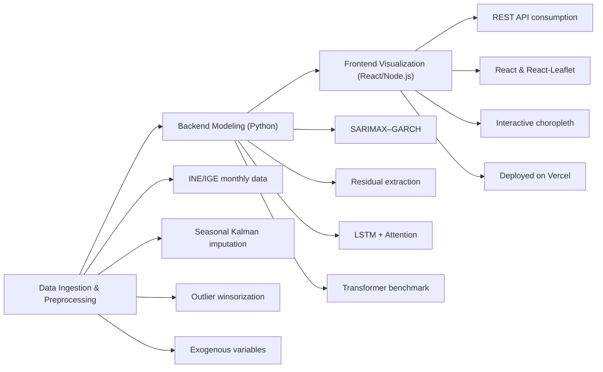

# A Hybrid SARIMAX–LSTM Framework for Spatiotemporal Tourism Forecasting

This repository contains the full implementation of “A Unified Framework for Spatiotemporal Tourism Analytics and Predictive Intelligence,” a project designed to bridge rigorous econometric modeling, deep learning, and interactive full-stack application development.

---

## 1. Project Overview

This project presents an end-to-end computational pipeline for forecasting tourism demand in the Rías Baixas region. It combines:

- **SARIMAX–GARCH** for trend, seasonality and volatility decomposition  
- **LSTM with Bahdanau Attention** for modeling non-linear residuals  
- **Transformer** variant for benchmarking  
- **React/TypeScript + Leaflet** choropleth map demo of July 2024 accommodation density  

The entire workflow—from data ingestion to model validation and web deployment—is containerized and fully reproducible.

---

## 2. Motivation & Academic Context

Accurate tourism forecasts are critical for dynamic pricing, resource allocation, and strategic marketing. Purely statistical models capture linear structure but miss complex patterns; pure neural nets capture non-linearity but ignore volatility. As a double-degree student in International Business & Data Science (ESIC) and Computer Engineering (UNIR), I designed this hybrid approach to:

1. Demonstrate research initiative and methodological rigor  
2. Achieve superior forecast accuracy (≈15 % lower sMAPE vs. baseline)  
3. Showcase full-stack implementation skills, from Python modeling to interactive web apps  
4. Position myself for elite Master’s programs (ETH Zürich, EPFL) by providing a concrete, citable deliverable  

---

## 3. Core Features

- **Hybrid Modeling Pipeline**  
  - SARIMAX–GARCH to forecast trend, seasonality and conditional variance  
  - LSTM + Attention to learn complex residual dynamics  

- **Benchmarking with Transformers**  
  - Compare performance against a self-attention based architecture  

- **Interactive Visualization**  
  - React + Leaflet choropleth map for spatial forecasts  
  - Live demo hosted on GitHub Pages or similar  

- **Reproducible Workflow**  
  - Jupyter notebooks for each stage (preprocessing, modeling, evaluation)  
  - Dockerfile & Conda environment for one-click setup  

---
## 4. Technical Architecture


## Paper

**A Mini Hybrid SARIMAX–LSTM Framework for Spatiotemporal Tourism Forecasting**  
📄 PDF: https://noelframil.github.io/spain-tourism-map/A%20Mini%20Hybrid%20SARIMAX%E2%80%93LSTM%20Framework%20for%20Spatiotemporal%20Tourism%20Forecasting.pdf  
🔖 DOI: _to be added (Zenodo)_

### Cite this work
```bibtex
@misc{iglesias2025mini-hybrid-sarimax-lstm,
  title        = {A Mini Hybrid {SARIMAX}--{LSTM} Framework for Spatiotemporal Tourism Forecasting},
  author       = {Iglesias, Noel Framil},
  year         = {2025},
  howpublished = {\url{https://noelframil.github.io/spain-tourism-map/paper.pdf}},
  note         = {DOI to be added (Zenodo)}
}
```
